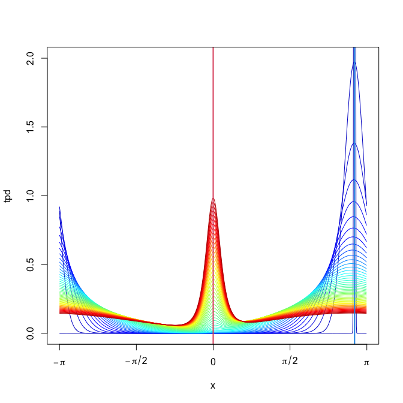

<!-- README.md is generated from README.Rmd. Please edit that file -->
sdetorus
========

[](https://travis-ci.org/egarpor/sdetorus) [](https://www.gnu.org/licenses/gpl-3.0)

<p align="center">
 <br> <i>Transition probability density of the Langevin diffusion guided by the "sdetorus" density</i>
</p>
 

Overview
--------

This library provides statistical tools for Maximum Likelihood Estimation (MLE) of toroidal diffusions. It is the package companion for the paper *Langevin diffusions on the torus: estimation and applications* (García-Portugués *et al.*, 2017).

Disclaimer
----------

The package is still in development and not fully tested nor documented. Use at your own risk!

Install
-------

The package uses lambda functions from `C++11` so it is required to set the appropriate compiler flags. [`Rtools`](https://cran.r-project.org/bin/windows/Rtools/) is required in Windows.

``` r
# install.packages("devtools")
library(devtools)
Sys.setenv("PKG_CXXFLAGS" = "-std=c++11")
Sys.setenv("PKG_LIBS" = "-llapack")
install_github("egarpor/sdetorus")
```

Usage
-----

### Example 1: simulation of diffusion trajectories

``` r
# Load package
library(sdetorus)

## vM diffusion in 1D

# Initial points
nx0 <- 50
x0 <- seq(-pi, pi, l = nx0 + 1)[-(nx0 + 1)]
plot(rep(0, nx0), x0, pch = 16, col = rainbow(nx0), xlim = c(0, 1),
     xlab = expression(t), ylab = expression(Theta[t]), axes = FALSE)
torusAxis(2)
axis(1)

# Trajectories of the vM diffusion
N <- 100
mu <- 0
set.seed(12345678)
samp <- euler1D(x0 = x0, mu = mu, alpha = 3, sigma = 1, N = N,
                delta = 0.01, type = 2)
abline(h = mu)
tt <- seq(0, 1, l = N + 1)
for (i in 1:nx0) linesCirc(tt, samp[i, ], col = rainbow(nx0)[i])
points(rep(1, nx0), samp[, N + 1], pch = 16, col = rainbow(nx0))
```


``` r

## WN diffusion in 2D

# Initial points
nx0 <- 10
x0 <- seq(-pi, pi, l = nx0)
x0 <- as.matrix(expand.grid(x0, x0))
nx0 <- nx0^2
plot(x0[, 1], x0[, 2], xlim = c(-pi, pi), ylim = c(-pi, pi), pch = 16,
     col = rainbow(nx0), xlab = expression(Theta[list(1,t)]),
     ylab = expression(Theta[list(2,t)]), axes = FALSE)
torusAxis()

# Trajectories of the WN diffusion
N <- 100
set.seed(12345678)
samp <- euler2D(x0 = x0, mu = c(0, 0), A = rbind(2:1, 1:2),
                sigma = c(1, 1), N = N, delta = 0.01, type = 1)
for (i in 1:nx0) linesTorus(samp[i, 1, ], samp[i, 2, ],
                            col = rainbow(nx0, alpha = 0.5)[i])
```


### Example 2: computation of transition probability densities

``` r
# Load package
library(sdetorus)

## Cauchy diffusion in 1D

# Drift
Mx <- 1e3
x <- seq(-pi, pi, l = Mx + 1)[-c(Mx + 1)]
mu <- 0
b <- driftJp(x = x, alpha = 1, mu = mu, psi = -1)

# Squared diffusion coefficient
sigma2 <- rep(1, Mx)

# Initial condition concentrated at x0
x0 <- pi - 0.25
sdInitial <- 0.01
u0 <- cbind(dWn1D(x = x, mu = x0, sigma = sdInitial))
periodicTrapRule1D(u0)
#> [1] 1

# Tpd for times t = 0.0, 0.1, 0.2, ..., 5.0
N <- 5e3
n <- seq(0, N, by = 100)
tpd <- crankNicolson1D(u0 = u0, b = b, sigma2 = sigma2, N = n, deltat = 2 / N,
                       Mx = Mx, deltax = 2 * pi / Mx)
matplot(x, tpd, type = "l", col = colorRamps::matlab.like2(length(n)),
        lty = 1, ylim = c(0, 2), axes = FALSE)
abline(v = c(x0, mu), col = c(4, 2), lwd = 2)
torusAxis(1)
axis(2)
```



``` r

## WN diffusion in 2D

# Function for computing and plotting a tpd
plotTpd <- function(t) {

  Mx <- 150
  tpd <- dTpdPde2D(Mx = Mx, My = Mx, x0 = c(pi / 2, -pi), t = t,
                   alpha = c(1, 1, 0), mu = c(0, 0), sigma = c(2, 1),
                   type = "WN", Mt = ceiling(1e2 * t), sdInitial = 0.1)
  x <- seq(-pi, pi, l = Mx)
  plotSurface2D(x = x, y = x, z = pmin(tpd, 0.25), axes = FALSE,
                xlab = expression(theta[1]), ylab = expression(theta[2]),
                main = paste("t =", t), levels = seq(0, 0.25, l = 20))
  torusAxis()
  points(c(0, pi / 2, pi / 2), c(0, -pi, pi), pch = 16, cex = 1)

}

# Tpd at different times
par(mfrow = c(2, 2))
plotTpd(t = 0.2)
plotTpd(t = 0.5)
plotTpd(t = 1.0)
plotTpd(t = 3.0)
```


### Example 3: approximate MLE in 1D

``` r
# Load package
library(sdetorus)

## WN diffusion in 1D

# Sample
set.seed(12345678)
N <- 500
delta <- 0.1
samp <- rTrajWn1D(x0 = 0, alpha = 0.5, mu = pi, sigma = 1, N = N, delta = delta)
tt <- seq(0, N * delta, by = delta)
plot(tt, samp, type = "n", ylim = c(-pi, pi), xlab = expression(t),
     ylab = expression(Theta[t]), axes = FALSE)
linesCirc(x = tt, y = samp)
axis(1)
torusAxis(2)
```


``` r

# Drift and diffusion
b <- function(x, pars) driftWn1D(x = x, alpha = pars[1], mu = pars[2],
                                 sigma = pars[3])
b1 <- function(x, pars, h = 1e-4) {
  l <- length(x)
  res <- driftWn1D(x = c(x + h, x, x - h), alpha = pars[1], mu = pars[2],
                   sigma = pars[3])
  drop(res[1:l] - 2 * res[(l + 1):(2 * l)] + res[(2 * l + 1):(3 * l)])/(h^2)
}
sigma2 <- function(x, pars) rep(pars[3]^2, length(x))

# Common optimization parameters
start <- 1:3
low <- c(0, -pi, 0)
up <- c(100, pi, 100)

# MLE by numerical solution of PDE
est1 <- mlePde1D(data = samp, delta = delta, b = b, sigma2 = sigma2, Mx = 5e2,
                 sdInitial = 0.05, start = start, lower = low, upper = up)

# Euler pseudo-likelihood
est2 <- psMle(data = samp, delta = delta, method = "E", b = b, sigma2 = sigma2,
              start = start, lower = low, upper = up)

# Shoji-Ozaki pseudo-likelihood
est3 <- psMle(data = samp, delta = delta, method = "SO", b = b, b1 = b1,
              sigma2 = sigma2, start = start, lower = low, upper = up)

# Approximate MLE based on the WOU process
est4 <- approxMleWn1D(data = samp, delta = delta, start = start, lower = low,
                      upper = up)

# Comparison
est1$par
#> [1]  0.5310225 -2.9645313  1.0423494
est2$par
#> [1]  0.4887261 -3.0923169  1.0340890
est3$par
#> [1] 0.3088016 2.7632043 1.0394086
est4$par
#> [1]  0.514412 -2.873781  1.060543
```

<!--

```r
## WN diffusion in 2D

# Sample
set.seed(12345678)
N <- 5e2
delta <- 0.1
samp <- rTrajWn2D(x0 = c(0, 0), alpha = c(0.5, 0.5, 0), mu = c(pi, pi),
                  sigma = c(1.5, 1.5), N = N, delta = delta)
plot(samp[, 1], samp[, 2], type = "n", ylim = c(-pi, pi),
     xlab = expression(Theta[list(1,t)]), ylab = expression(Theta[list(2,t)]),
     axes = FALSE)
linesTorus(x = samp[, 1], y = samp[, 2], col = rainbow(N + 1))
torusAxis()
```


```r

# Drift and diffusion
b <- function(x, pars) driftWn2D(x = x, A = alphaToA(alpha = pars[1:3],
                                                     sigma = pars[6:7]),
                                 mu = pars[4:5], sigma = pars[6:7])
jac.b <- function(x, pars, h = 1e-4) {
  l <- nrow(x)
  res <- b(x = rbind(cbind(x[, 1] + h, x[, 2]),
                     cbind(x[, 1] - h, x[, 2]),
                     cbind(x[, 1], x[, 2] + h),
                     cbind(x[, 1], x[, 2] - h)), pars = pars)
  cbind(res[1:l, ] - res[(l + 1):(2 * l), ],
        res[2 * l + 1:l, ] - res[2 * l + (l + 1):(2 * l), ]) / (2 * h)
}
sigma2 <- function(x, pars) matrix(pars[6:7]^2, nrow = length(x) / 2L, ncol = 2)

# Common optimization parameters
start <- c(1, 1, 0.5, 0, 0, 1, 1)
low <- c(0.01, 0.01, -25, -pi, -pi, 0.01, 0.01)
up <- c(25, 25, 25, pi, pi, 25, 25)

# Euler pseudo-likelihood
est1 <- psMle(data = samp, delta = delta, method = "E", b = b, sigma2 = sigma2,
              start = start, lower = low, upper = up)

# Shoji-Ozaki pseudo-likelihood
est2 <- psMle(data = samp, delta = delta, method = "SO", b = b, jac.b = jac.b,
              sigma2 = sigma2, start = start, lower = low, upper = up)
#> <simpleError in eigen(x = jac.bx, symmetric = FALSE): infinite or missing values in 'x'>

# Approximate MLE based on the WOU process
est3 <- approxMleWn2D(data = samp, delta = delta, start = start, lower = low,
                      upper = up)
#> Warning in specPars[indUnSpecPars] <- pars: number of items to replace is
#> not a multiple of replacement length

#> Warning in specPars[indUnSpecPars] <- pars: number of items to replace is
#> not a multiple of replacement length
#> <std::runtime_error in dTpdWou2D(x = y, x0 = x, t = delta, alpha = specPars[1:3], mu = specPars[4:5],     sigma = specPars[6:7], rho = specPars[8], maxK = maxK): inv_sympd(): matrix is singular or not positive definite>

# Comparison
est1$par
#> [1] NA
est2$par
#> [1] NA
est3$par
#> [1] NA
```
-->
Reproducibility of García-Portugués *et al.* (2017)
---------------------------------------------------

The directories [`/MD`](https://github.com/egarpor/data-langevintorus/tree/master/MD) and [`/simulation`](https://github.com/egarpor/data-langevintorus/tree/master/simulation) in the [data-langevintorus](https://github.com/egarpor/data-langevintorus) repository contain the scripts used in the empirical analyses of the aforementioned paper, as well as their `.RData` outputs. Those files are not downloaded when installing `sdetorus`.

References
----------

García-Portugués, E., Sørensen, M., Mardia, K. V. and Hamelryck, T. (2017). Langevin diffusions on the torus: estimation and applications. *Statistics and Computing*, <https://doi.org/10.1007/s11222-017-9790-2>.
